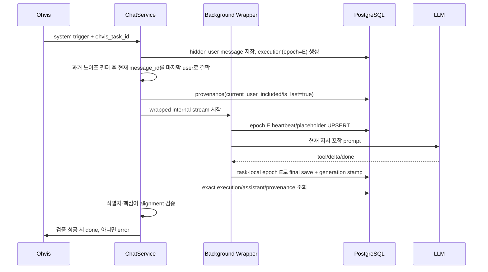

# System Trigger Context & Generation Fencing P0 PRD

- 문서 상태: 구현 및 운영 검증 진행 중
- 작성일: 2026-09-21
- 대상 서비스: AADS Chat / Ohvis 자동 반응 / 실행 복구기
- 우선순위: P0
- 기준 사고: 세션 `ac5278a7-2f13-4cd7-9aa1-83d41fb23c97`
- 사고 실행: `0ca8fa07-d39d-421b-8530-8cc24eaf729c`
- 연관 Ohvis 작업: `dd50c1eb-e26a-4dc2-9b9c-931706c43598`
- 상세 오류노트: `docs/handover-notes/20260921_SYSTEM_TRIGGER_STALE_RESPONSE_ERROR_NOTE.md`

## 1. 문제 정의

Ohvis가 사용자의 실행 지시를 숨김 `system_trigger` 메시지로 저장한 뒤 AI 자동 반응을 시작할 때 다음 결함이 결합됐다.

1. 과거 시스템 노이즈를 제외하는 히스토리 필터가 현재 턴의 트리거까지 제거했다.
2. 내부 자동 반응은 HTTP SSE 경로의 `with_background_completion()`을 거치지 않아 활성 작업 등록과 lease heartbeat가 빠졌다.
3. lease를 잃은 구 producer가 프로세스 전역 epoch 캐시를 읽어 새 epoch를 자기 소유처럼 사용했다.
4. Ohvis는 정확한 실행과 지시 관련성을 확인하지 않고 응답 문자열이 존재한다는 이유만으로 작업을 `done` 처리했다.
5. 현재 지시가 빠진 상태에서 과거의 짧은 질문이 `status_check`로 분류돼 경량 모델로 내려가며 오답을 증폭했다.

결과적으로 사용자가 요구한 “목표 등록 → PRD 저장 → 작업 세분화 → 마일스톤 등록 → 진행” 대신 과거 브라우저 탭 질문을 답했고, 올바른 재개 worker는 오답이 먼저 완료된 뒤 fence-out 됐다.

## 2. 목표

- 현재 턴의 사용자/시스템 트리거를 모델 입력의 마지막 사용자 메시지로 정확히 1회 포함한다.
- 모든 내부 자동 반응을 일반 SSE와 동일한 heartbeat·중간저장·background completion 경로로 통합한다.
- execution write 권한을 `owner_instance + owner_epoch`의 태스크 로컬 스냅샷으로 고정한다.
- 구 generation은 새 epoch의 placeholder, 최종 메시지, execution 완료 상태를 변경할 수 없게 한다.
- Ohvis `done`은 정확한 execution, 현재 지시 포함 provenance, 관련 응답을 모두 검증한 뒤에만 허용한다.
- 복잡한 자동 지시는 `status_check` 후속 문맥 오분류로 모델이 강등되지 않게 한다.
- 사고 원인, 재발 방지책, 수정 커밋을 공용 오류 사전에 남긴다.

## 3. 비목표

- 모든 응답 품질을 LLM 평가 하나로 보장하지 않는다.
- 과거 `system_trigger` 전체를 일반 대화 이력에 다시 노출하지 않는다.
- 실행 복구 스캐너의 전체 재설계나 lease 시간 자체의 증가는 하지 않는다.
- 사용자에게 숨김 자동 트리거 원문을 UI 버블로 노출하지 않는다.

## 4. 제품 요구사항

### FR-1 현재 턴 결합

- 이력 조회는 기존처럼 과거 `system_trigger`, `runner_response`, placeholder를 제외한다.
- 조회가 끝난 뒤 현재 저장 메시지 ID와 정확히 일치하는 행을 제거하고, 원본 현재 지시를 마지막 `user` 메시지로 1회 추가한다.
- 일반 사용자 턴, 분기 턴, 숨김 자동 트리거가 같은 결합 함수를 사용한다.
- provenance에 다음 값을 저장한다.
  - `current_user_message_id`
  - `current_user_included`
  - `current_user_occurrences`
  - `current_user_is_last`
  - `current_user_in_llm`
  - `current_user_is_last_llm`

### FR-2 내부 스트림 경로 통합

- `trigger_ai_reaction()`과 후속 큐 소비기는 `send_message_stream()`을 직접 순회하지 않는다.
- 공통 내부 소비기는 `with_background_completion()`으로 스트림을 감싼다.
- 이로써 `_active_bg_tasks`, 독립 heartbeat, lease 연장, 중간 저장, 완료 보정이 HTTP 턴과 동일하게 적용돼야 한다.

### FR-3 불변 epoch fence

- producer는 실행 생성/claim 시점의 epoch를 `ContextVar`와 streaming state에 캡처한다.
- 최종 저장은 명시적 epoch 또는 동일 execution에 결합된 태스크 로컬 epoch만 사용한다.
- 프로세스 전역 `_execution_owner_epochs`는 최신 claim 관측 캐시일 뿐 write 권한 증명이 아니다.
- 중간 저장 중 DB epoch와 state epoch가 다르면 state를 종료하고 `execution_lease_epoch_mismatch`를 기록한다.
- placeholder UPSERT 자체에 `owner_instance + owner_epoch + non-terminal` 조건을 넣어 검증과 쓰기 사이 race도 차단한다.
- 최종 assistant 메시지에 execution의 `generation_id`를 명시적으로 스탬프한다.

### FR-4 의미 완료 게이트

Ohvis 작업은 아래 조건을 모두 만족할 때만 `done`이다.

1. 내부 소비기가 반환한 정확한 `execution_id`가 존재한다.
2. execution 상태가 `completed`다.
3. `assistant_message_id`로 연결된 정확한 응답이 존재한다.
4. provenance에서 raw history와 최종 LLM messages 모두 현재 사용자 메시지를 포함하며 마지막 사용자 턴이다.
5. 지시의 UUID, 커밋, 파일 경로 같은 강한 식별자 또는 핵심 키워드가 응답에 일치한다.

하나라도 실패하면 Ohvis 작업은 `error`로 종료하고 `result.validation`에 판정 근거를 저장한다. 단순히 “마지막 assistant 메시지가 존재함”은 완료 근거가 아니다.

### FR-5 복잡 자동 지시 라우팅

- 자동 반응 본문이 구현·검증·배포·분석 등 quality 조건을 만족하면 내부 route intent를 `execute`로 고정한다.
- UI 격리를 위한 최종 메시지 intent `runner_response`는 유지한다.
- 사용자가 명시한 모델 또는 DB 기본 모델 정책은 그대로 존중한다.

## 5. 설계

### 소유권 불변식

`write_allowed = execution.owner_instance == local_instance AND execution.owner_epoch == producer.captured_epoch AND execution.completed_at IS NULL`

DB에서 최신 epoch를 다시 읽어 producer의 캡처 값을 덮어쓰는 행위는 금지한다. 최신 값을 읽는 것은 “내가 주인인가”를 비교하기 위한 것이지 “최신 주인이 된다”는 뜻이 아니다.

## 6. 오류 처리와 관측성

- 현재 메시지 ID가 provenance에 없으면 의미 완료 게이트를 닫는다.
- exact execution 또는 assistant 연결이 없으면 `exact_execution_completion_not_found`로 기록한다.
- 관련성 실패는 `semantic_completion_gate_failed`로 기록한다.
- epoch 불일치는 `interim_save_stopped_epoch_mismatch` 로그와 state 종료 사유로 남긴다.
- 최종 저장에 task-local epoch가 없으면 `final_save_skipped_missing_task_epoch`로 fail closed 한다.
- Ohvis result에는 execution ID, assistant message ID, binding 플래그, 일치 식별자/키워드를 저장한다.

## 7. 테스트 계획

### 단위 테스트

- 필터에서 빠진 현재 `system_trigger`를 정확히 1회 마지막에 추가한다.
- 이미 존재하는 현재 메시지도 중복 없이 마지막으로 이동한다.
- 프로세스 전역 epoch가 2로 바뀌어도 epoch 1 producer의 태스크 로컬 값은 1이다.
- epoch 1 state가 DB epoch 2를 만나면 heartbeat/placeholder 쓰기 전에 fence-out 된다.
- 내부 자동 반응이 반드시 background completion wrapper를 통과한다.
- 목표 UUID/PRD 지시와 무관한 과거 브라우저 답변은 의미 검증에 실패한다.
- 기존 최종 저장/TODO/복구 fence 회귀군을 통과한다.

### 운영 검증

- 테스트 자동 트리거의 provenance에서 `current_user_included=true`, `current_user_is_last=true` 확인.
- 실행 중 60초 이상 모델/도구 대기 시 owner epoch가 불필요하게 증가하지 않는지 확인.
- assistant `generation_id`와 execution `generation_id` 일치 확인.
- Ohvis 작업 결과의 `validation.valid=true`와 exact execution ID 확인.
- 배포 후 5분 동안 새 P0/P1, lease mismatch, stale reclaim, final-save fence 오류 모니터링.

## 8. 배포 및 롤백

1. 최신 `origin/main` 기반 깨끗한 worktree에서 테스트한다.
2. 커밋·push 후 해당 release SHA로 immutable image를 1회 빌드한다.
3. candidate 직접 health → 짧은 nginx lock cutover → routed/external health를 확인한다.
4. 동일 digest로 standby를 동기화한다.
5. 운영 DB와 로그를 최소 5분 관찰한다.

롤백 조건은 health 실패, 현재 턴 provenance 누락, 새 epoch 핑퐁, 정상 자동 반응의 대량 `semantic_completion_gate_failed`다. 롤백 시 즉시 이전 active image로 라우팅을 되돌리되, 잘못 `done` 처리된 기존 사고 데이터는 복구 전 상태로 되돌리지 않는다.

## 9. 마일스톤

- [x] M1 사고 실행·메시지·Ohvis 작업 상관관계 확인
- [x] M2 현재 트리거 프롬프트 누락 원인 확정
- [x] M3 heartbeat 우회와 stale reclaim 원인 확정
- [x] M4 구 producer epoch 탈취 원인 확정
- [x] M5 의미 검증 없는 완료 처리 원인 확정
- [x] M6 현재 턴 결합 및 provenance 구현
- [x] M7 내부 스트림 wrapper 통합
- [x] M8 task-local epoch fence 및 generation stamp 구현
- [x] M9 Ohvis 의미 완료 게이트 구현
- [x] M10 전체 관련 회귀 테스트
- [x] M11 커밋·push·Blue/Green 배포
- [x] M12 운영 데이터 보정 및 5분 모니터링
- [x] M13 공용 오류 사전 등록 및 최종 보고

## 10. 완료 기준

- 코드·테스트·PRD·오류노트가 동일 커밋 계보에 존재한다.
- 관련 단위 테스트가 통과한다.
- 원격 main 반영과 Blue/Green 동일 digest가 확인된다.
- 운영 health 및 외부 HTTPS가 정상이다.
- 사고 Ohvis 작업의 허위 `done` 상태가 보정된다.
- 공용 오류 사전에 원인, prevention, fix commit이 등록된다.
- 5분 P0/P1 모니터링 동안 새 오류가 없다.

## 11. 완료 실측 (2026-09-21)

- 수정 커밋 `23a0636f31df7ced4b006351481e49ee225de7a3`을 `origin/main`에 push했다. 이후 최신 main `74fa07bdf925`도 이 커밋의 후손임을 확인했다.
- 배포 원장 `4931`로 Blue/Green 전환을 수행했고, 300초 연속 release P0/P1 감시를 통과했다.
- 활성 `aads-server:8100`과 standby `aads-server-green:8102`는 모두 `aads-server:23a0636f31df`, image digest `sha256:7cf974edd1ca636526cd31679caccd38169146803ce5ae5ccb43cf702a7f3ee6`로 healthy다.
- standby 동일 digest 인증 후 `deploy_runs#4931`은 `success_partial`에서 `success`로 승격됐다.
- 외부 `https://aads.newtalk.kr/api/v1/health`는 `status=ok`, `graph_ready=true`를 반환했다.
- 배포 전 추적한 실행 7건은 모두 원장상 소실 없이 정리됐다: 동일 execution 재개 2건, 완료 2건, partial 보존 후 새 current execution으로 승계 3건이다.
- 특히 장시간 실행 `ebdbbf1a`는 epoch `2 -> 4 -> 5`, 세션 `2648cf77`의 실행 `7eb645e3`은 epoch `4 -> 5`로 새 활성 슬롯이 회수해 이어서 시작했다.
- 최종 시점의 live execution 8건은 전부 `aads-server` 단일 소유이며, standby live execution은 0건, 세션별 중복 active execution은 0건, terminal row의 유효 lease는 0건이다.
- 사고 Ohvis 작업 `dd50c1eb-e26a-4dc2-9b9c-931706c43598`과 task card를 `error`로 보정했고, 사고 assistant 메시지는 감사 추적을 위해 보존했다.
- 공용 오류 사전에 `chat.system_trigger_current_turn_generation_fence`를 등록했다.
- 별도 운영 경보로 루트 디스크 사용률 86.3%(실측 87%, 여유 27GB)가 관찰됐다. 릴리스 오류는 아니지만 80% 경보 임계값을 넘었으므로 용량 정리가 필요하다.
