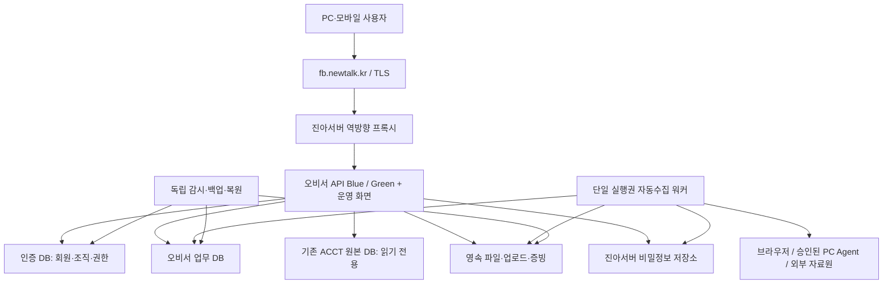

# 오비서 전체 이전 PRD — AADS 인증 포함 진아서버 독립 운영

| 항목 | 내용 |
|---|---|
| 문서 ID / 버전 | OBYS-MIGRATION-JINAH / v1.1 |
| 상태 | 정식 요구사항·설계안 작성 완료 / 구현·이전 미착수 |
| 요청 | “aads 인증 포함 전체 모두 이전 하는 방안을 정식 정리해서 PRD로 보고해” |
| 관리 프로젝트 | AADS — 이전 대상 인프라는 jinah244(5.104.85.244) |
| 현재 출발점 | contabo116(5.104.86.116)의 오비서 및 AADS 공유 인증 |
| 조사 기준 | 2026-09-23 12:35:31 KST 실측, 로컬 HEAD `cdc557310d8203cf904e0dbc95d1300f66485b6e` |
| 재개 검수 | 2026-09-23 12:42:29 KST 실측 이후 핵심 코드·인증 테이블·문서 충돌 조회 재확인; v1.0 작성본을 보존하고 추출·증거 계약 보강 |
| 증거 범위 | 로컬 코드·Compose, AADS DB 스키마·작업/변경 원장, PostgreSQL·JWT 공식 문서 |
| 주의 | 로컬 업무 API·화면에는 다른 세션의 미커밋 변경이 있다. 아래 코드 관찰은 운영 이미지의 동작 보증이 아니다. 이전 릴리스는 별도 확정한다. |

## 1. 결론과 제품 목표

오비서가 사용하는 **회원 인증·조직·권한·화면·업무 API·업무 DB·파일·자동수집·운영 체계 전체를 진아서버로 옮겨 독립 운영**한다. 로그인만 AADS에 남기는 이전안은 최종 목표로 채택하지 않는다.

기존 공개 주소 `https://fb.newtalk.kr`를 유지하는 구성을 기본안으로 한다. 오비서가 AADS 서버의 DB·인증 API·파일·워커·브라우저 중계에 접근하지 못해도 핵심 업무가 작동해야 이전 완료다. 개발·관리용 AADS 관제 연결은 선택 사항이며 오비서 업무 가용성의 필수 의존성이 되어서는 안 된다.

문맥상 “전체”는 **오비서 운영에 필요한 AADS 인증 기능과 데이터까지 전부**를 뜻한다. AADS 자체의 채팅·다른 프로젝트·전체 Runner 플랫폼을 진아서버로 옮기는 사업은 이 PRD의 범위가 아니다. 공용 코드는 재사용하되 인증 런타임과 정본 DB는 진아서버에 둔다.

이번 문서 작성은 이전 실행을 의미하지 않는다. 운영 DB 이동·DNS 변경·서비스 중단은 검증된 실행계획을 기준으로 별도 실행 단계에서 수행한다.

## 2. 대상 사용자와 사용자 흐름

| 사용자 | 첫 진입 | 반복 업무 | 실패 복구 |
|---|---|---|---|
| 대표/조직 소유자 | 기존 주소 → 로그인 → 유효한 마지막 업무 조직·사업자 → 업무 현황 | 열정국밥/라일론 조직 전환, 기간·거래처·계좌별 조회, 등록 | 세션 만료 시 돌아올 화면을 유지해 재로그인, 권한 없는 조직은 선택 불가 |
| 회계/업무 담당자 | 초대 수락 또는 가입 → 승인된 조직 | 엑셀·수기 등록 → 검증 → 저장 → 목록·상세·집계 확인 | 오류 행·중복 행·저장 여부 표시, 같은 요청 재시도 시 중복 생성 방지 |
| 지점 담당/조회 사용자 | 소속 사업자와 허용 메뉴로 진입 | 권한 범위 내 조회·입력 | 조직·사업자 접근 거부 사유와 관리자 문의 경로 제공 |
| 운영 관리자 | 별도 관리 메뉴 | 수집 상태·백업·오류·재처리·사용자 관리 | 수집 인증 만료 시 해당 연결만 재인증, 일반 업무 조회는 유지 |

일반 첫 화면을 서버 설정·연결 관리로 바꾸지 않는다. 모바일 조직 선택, 긴 표 스크롤, 상세 모달, 새로고침 후 선택 복구도 검증한다. 레거시 주소로 들어와도 정식 운영 화면으로 이동하고 로그인 반복이 없어야 한다.

## 3. 확인한 현재 구조와 이전 차단 요인

| 확인 사항 | 근거 | 문제/영향 | 필수 대응 |
|---|---|---|---|
| 별도 실행점 존재 | `app/yeoljeong_main.py` | 전용 앱은 있지만 이것만 실행하면 전체 업무 동등성을 보장하지 못함 | 현재 공개 경로와 모든 메뉴의 호출 API를 대조 |
| 라우터 구성 차이 | 전용 앱과 `app/main.py`의 `include_router` | 전용 앱에는 dashboard/accounting/ops/acct_sales 등록이 없음 | 실제 사용 API의 METHOD+PATH 목록을 고정하고 누락 등록·의존성 보완 |
| 인증 DB는 공용 | `app/auth.py::_get_pool` → `DATABASE_URL` | 회원·조직·권한 조회가 AADS DB에 남음 | 진아서버 인증 전용 DB와 설정을 분리 |
| 조직 생성의 채팅 의존성 | `create_tenant_for_user` → `ensure_default_customer_workspace` → `chat_workspaces` | 인증 테이블만 복원하면 신규 조직 생성 실패 가능 | 오비서 조직 생성은 업무 초기화만 실행하도록 분리 |
| 인증 API의 부가 의존성 | `app/api/auth.py`, `tenant_usage_limits.py` | 사용량 API가 공용 DB 풀과 AADS 사용량 테이블을 참조 | 필요한 정책/사용량을 로컬 구현; 노출 API를 빈 성공 응답으로 대체 금지 |
| 인증 스키마 초기화 조건 | `require_saas_schema_ready` | internal 조직·함수까지 요구함 | 오비서 전용 부트스트랩 계약으로 교정, 내부 관리자 자동 권한 부여 금지 |
| 업무 DB 선택 방식 불일치 | `app/core/obys_db.py`, `yeoljeong_finance_service.py::_db_url` | 일부는 OBYS 전용 강제, 일부는 finance/AADS DSN으로 폴백 | 모든 업무 저장소를 명시적 OBYS DB로 고정하고 설정 누락 시 실패 |
| 원본 조회는 직접 DSN 지원 | `ceo_chat_tools_db.py::query_acct_database` | DSN 미설정 시 SSH 경유, RLS 문맥 보존 필요 | 진아서버 내부 연결로 변경, 읽기 전용·`acct.tenant_id` 유지 |
| 원본 회사 매핑 존재 | `acct_purchase.py::_acct_company_map` | 오비서 UUID와 ACCT 숫자 ID는 다른 식별 체계 | 기존 식별자를 보존하고 사업자→ACCT tenant/company 매핑 검증 |
| 파일·비밀키·중계 상태 사용 | Compose, `obys_upload_service.py`, finance 서비스 | DB만 복사하면 첨부 누락·복호화 실패·수집 중단 | 파일 해시 목록, 키 참조, 브라우저/PC 연결·워커 이전 포함 |
| 정적 화면이 저장한 인증 상태 사용 | `mockup-v4-1.html` | localStorage·쿠키의 구 토큰으로 로그인 반복 가능 | 토큰 폐기·재로그인·동일 호스트 쿠키 정리와 복귀 동선 검증 |

AADS `information_schema.tables` 조회로 `saas_users`, `saas_user_consents`, `tenants`, `tenant_memberships`, `tenant_invites`, `tenant_plan_limits`, `tenant_usage_overrides`의 존재를 확인했다. **이 목록은 이전 데이터 전체 목록이 아니다.** FK·함수·뷰·트리거·RLS·파일 의존성을 포함한 확정 목록은 M0 산출물이다.

진아서버의 현재 CPU/메모리/디스크·PostgreSQL 버전·Docker/Nginx·DNS 권한은 이번 턴에서 재실측하지 않았다. 이전 대화의 자원 수치를 용량 산정에 재사용하지 않으며 M0에서 측정한다. 현재 거래 건수·금액·사업자 수 역시 이 문서에서 확정하지 않는다.

## 4. 목표 아키텍처와 선택 근거



인증 DB 이름은 `obys_identity`를 제안하고, 업무 DB는 `obys`, 기존 원본은 `acct`로 논리 분리한다. 실제 이름과 소유자는 M0에서 확정한다. 같은 PostgreSQL 인스턴스 사용 여부도 연결 수·I/O 부하 검증 후 결정한다.

| 방식 | 장점 | 한계 | 판정 |
|---|---|---|---|
| 인증까지 진아서버 독립 이전 | AADS 장애가 로그인·업무에 전파되지 않음 | 인증 분리·전체 회귀 검증 필요 | 권장 |
| 화면/업무만 이전, AADS 인증 유지 | 초기 변경량이 적음 | 대표님 요청의 완전 이전 미충족 | 최종안 제외 |
| AADS 전체 DB·플랫폼 통째 복제 | 초기 코드 재사용 가능 | 불필요한 프로젝트·비밀·워크로드와 결합 지속 | 비권장 |

기존 AADS와 오비서 양쪽을 사용하는 동일 사용자도 오비서의 권한·비밀번호 수명주기는 전환 후 진아서버가 관리한다. **양방향 비밀번호/조직 동기화를 암묵적으로 유지하지 않는다.** 전사 SSO가 필요하면 별도 인증 서비스 설계가 필요하며 이번 독립 이전의 선행 의존성으로 만들지 않는다.

## 5. 기능 요구사항

| ID | 우선순위 | 요구사항 | 완료 기준 |
|---|---|---|---|
| AUTH-01 | P0 | 오비서 대상 회원 ID·이메일·비밀번호 해시·상태·동의 이력 보존 | 기존 계정으로 로컬 인증 성공, 비밀번호 원문 미수집 |
| AUTH-02 | P0 | 조직·멤버십·owner/admin/member/viewer·초대·기본 조직 이전 | 두 업무 조직 전환 및 사용자별 권한 일치, 비활성 권한 복원 금지 |
| AUTH-03 | P0 | 가입·조직 생성·초대 수락의 AADS 채팅 의존성 제거 | AADS 연결 차단 상태에서 신규 가입→조직→사업자 생성 성공 |
| AUTH-04 | P0 | 인증 DB/키/관리자 접근 로컬화 | AADS 인증 API·DB 요청 없음, 관리자 우회 권한 없음 |
| AUTH-05 | P0 | 오비서 전용 새 서명키·발급자/대상 검증·토큰 폐기 | 구 AADS 토큰 거부, 로컬 새 토큰만 허용, 만료 복구 정상 |
| AUTH-06 | P0 | 로그인·로그아웃·조직 전환·계정 비활성화 일관성 | 쿠키/브라우저 상태 정리, 권한 철회 후 서버 요청 거부 |
| AUTH-07 | P1 | 비밀번호 변경/복구·가입 남용 방지·감사 기록 로컬화 | 지원 기능 계약 확정, 일회성 복구·만료·재사용 거부 검증 |
| APP-01 | P0 | 운영 메뉴·목록·상세·엑셀/수기 등록·출력 경로 보존 | 메뉴→버튼→API→DB 추적표 전 항목 검증 |
| APP-02 | P0 | 정식 URL·레거시 전환·모바일 접근 유지 | 로그인 후 정식 화면, PC/모바일 캡처, 콘솔 오류 없음 |
| DATA-01 | P0 | 업무 DB·파일·키 참조의 일관 이전 | 건수·금액·PK/FK·파일 해시 대조 통과 |
| DATA-02 | P0 | ACCT 원본은 같은 서버에서 안전하게 조회 | 회사/RLS 문맥 보존, 타 회사 접근 거부, 원본 변경 없음 |
| DATA-03 | P0 | 신규 등록 즉시 목록·상세·집계 반영 | 아래 신규 등록 시나리오 전부 통과 |
| COLLECT-01 | P0 | 워커·재시도·스케줄·인증 상태·체크포인트 이전 | 단일 실행권, 동일 파일/거래 중복 없음, 장애 후 이어받기 |
| OPS-01 | P0 | Blue/Green·백업·독립 관제·무손실 롤백 | 전환/복귀 리허설 및 5분 P0/P1 관제 통과 |
| OPS-02 | P0 | 설정·비밀·저장 경로의 AADS 폴백 제거 | AADS egress 차단 회귀 통과, 누락 설정은 명시적 오류 |

AUTH-07 중 기존에 제공 중인 기능은 이전 당일 동등성 기준에도 포함한다. 미구현인 기능은 새 요구사항으로 식별하며 기존 구현이라고 보고하지 않는다. 계획상 P1 기능이 남아 있으면 “이전 인증 완료”와 “PRD 전체 기능 완료”를 구분한다.

## 6. 이전 데이터 계약

| 데이터 묶음 | 이전 방식 | 검증/주의 |
|---|---|---|
| 회원·동의·조직·멤버십·초대 | 오비서 조직과 관계된 사용자/FK 관계를 닫힌 집합으로 내보내기 | ID·해시·기본 조직·삭제/정지 상태 보존. 관련 없는 AADS 조직 접근은 부여하지 않음 |
| 정책·권한·감사 | 참조되는 정책/역할/함수/이력만 확정 목록으로 이전 | 관리자 환경변수 폴백과 internal 조직 특별권한 별도 검수 |
| 오비서 업무 DB | 전용 DB의 전체 스키마·데이터·인덱스·시퀀스·뷰·함수·트리거·RLS | 테이블명 접두사만으로 범위를 결정하지 않음. 마이그레이션 버전까지 기록 |
| 사업자·지점·계좌·카드 | 현재 식별자와 연결관계 그대로 보존 | 사업자 번호로 임의 합치지 않음. 열정국밥/라일론 기대 목록은 M0 DB 조회로 확정 |
| 원본 ACCT·정규화 데이터 | 기존 진아서버 DB 유지, 조회 어댑터와 권한 교정 | `company_id`, 숫자 tenant와 오비서 UUID 혼동 금지; 원본 파일/행 lineage 유지 |
| 수기·업로드·중복 판정 | 저장 행·업로드 메타데이터·source_hash·취소 상태 전체 | 원본+수기+업로드를 합산할 때 중복 증가와 날짜 이동 없음 |
| 첨부·엑셀·계약·인감·급여 자료 | 경로/크기/SHA-256 manifest에 따라 영속 저장소 복사 | 민감 파일 공개 정적 디렉터리 노출 금지, 다운로드 권한과 해시 대조 |
| 연동 비밀정보 | 승인된 보안 채널로 필요한 항목만 이전/재암호화 | 키 원문·토큰·쿠키·계좌 전체번호는 PRD/로그/Git에 기록 금지 |
| 브라우저·PC Agent | 장치/서비스별 연결·승인·재인증 경로 재설정 | 세션 파일 복사만으로 인증 성공 처리 금지; 실제 수집 검증 |
| 수집 작업·실패 큐 | 체크포인트·작업 ID·멱등키·재시도 상태 이전 | 두 호스트 파일 lock은 상호 배제하지 못함. 중앙 실행권/epoch로 중복 실행 차단 |

암호화 키는 최초 복호화 검증에 필요한 구 버전을 안전하게 유지하고 새 저장소로 재암호화한 뒤 검증한다. JWT 서명키와 업무 자격증명 암호화 키는 목적이 다르므로 동일한 교체 절차로 취급하지 않는다.

공유 인증 DB는 전체 덤프를 새 운영 인증 DB에 그대로 복원하지 않는다. 추출기는 승인된 조직 ID를 출발점으로 멤버십·회원·동의·초대·정책 참조를 추적하고, 각 테이블의 명시적 컬럼·조건·참조 관계를 manifest에 기록한다. 공유 회원의 다른 AADS 조직 멤버십은 제외하며 기본 조직이 제외 대상이면 포함된 유효 조직으로만 재설정한다. 일반 DB 덤프의 테이블 선택만으로 행 단위 조직 필터가 구현됐다고 간주하지 않는다. 추출 결과는 격리 staging에서 FK·누락·허용 집합 외 데이터 유입을 검사한 뒤 원래 ID로 대상에 반영한다. 재실행 멱등성과 신규 시퀀스 충돌 방지는 필수다.

인증/업무/ACCT의 계정은 각각 최소 권한을 갖는다. 대상 PostgreSQL 버전·확장·collation·타임존·역할/RLS 호환성은 복원 전에 실측하며 **현재 문서의 공식 문서 버전이 설치 버전이라는 뜻은 아니다.**

## 7. 업무별 동등성 및 신규 등록 검증

| 업무 | 필수 조회/상세 | 입력·버튼 검증 | 원본 대조 |
|---|---|---|---|
| 매출 | 사업자→매출처/채널→기간→건별 | 엑셀·수기 저장, 필터 초기화, 상세 재조회 | 공급가·세액·합계·취소/중복을 분리 |
| 매입 | 사업자→매입처→기간→증빙·전표 | 등록·검증·중복 처리·상세/다운로드 | 원본/정규화/화면 동일 조건 대조 |
| 통장·입출금 | 사업자→계좌→기간→거래 | 입금/출금 등록, 실제 계좌 식별, 미확정 분리 | 입출금 부호·합계, 계좌코드 연결 근거 |
| 카드 | 사업자→카드사/마스킹 번호→승인/취소 | 엑셀·수기, 카드 상세·원문 | 승인/취소 중복 방지, 비밀정보 마스킹 |
| 세무 증빙 | 세금계산서·계산서·현금영수증, 매출/매입 | 유형 선택·입력·조회·첨부·수정 이력 | 면세/과세·매입/매출 분류 보존 |
| 전표 | 기간·사업자·전표 번호→차/대변 상세 | 현재 허용된 생성·수정·확정·역분개 흐름 | 차대변 일치·마감잠금·원본 보호; 쓰기 동결 설정 임의 해제 금지 |
| 인사·급여·재고·발주·승인·보고 | 현재 제공하는 각 업무의 전용 목록/상세 | 권한별 동작·첨부·출력 | 메뉴/API/DB manifest로 누락 없이 검증 |
| 수집/설정 | 서비스·사업자별 마지막 성공·오류·인증 상태 | 재시도·재인증·엑셀 대체등록 | 수집 결과와 사용자 등록 결과가 동일 조회 규칙 사용 |

신규 등록 필수 시나리오:

1. 기존 대표 계정 로그인과 신규 사용자 가입을 각각 수행하고 조직·사업자·지점을 생성한다. AADS 내부 조직이 기본 선택되지 않아야 한다.
2. 매출·매입·카드·통장·증빙을 테스트 테넌트에 입력한다. 저장 응답 ID를 사용해 목록·건별 상세·기간 합계·새로고침 후 값을 확인한다.
3. KST 자정 인근 날짜, 월 경계, 공급가/세액/총액, 입금/출금, 취소를 검증한다. 당일 입력이 전날 조회로 이동하지 않아야 한다.
4. 같은 파일 재업로드, 저장 버튼 중복 클릭, 응답 유실 후 재시도에서 중복 행/금액이 늘지 않아야 한다. 중복/거부 행과 원인을 화면에 표시한다.
5. 조직·사업자·계좌·카드 ID를 다른 소속 값으로 바꿔 조회/상세/수정/다운로드 시도한다. 서버가 거부해야 한다.
6. 검증 실패·네트워크 끊김은 입력값과 미저장 상태를 보존한다. 복구 후 저장 여부를 다시 조회하며 성공 문구만 띄우는 버튼을 허용하지 않는다.
7. 모바일에서 등록 버튼·파일 선택·오류 행·스크롤·상세 닫기·재로그인을 실제 조작하고 캡처한다.

원본에 거래일·주문번호가 없는 매출 자료는 서버를 옮겨도 일별 매출로 생성할 수 없다. 식별 불가 계좌 역시 추정 연결하지 않는다. 원천 부재/정규화 미완/연결 실패/조건 내 0건은 각각 표시한다. 이 기존 데이터 품질 과제는 이전 전후 baseline으로 별도 추적하며 “이전 성공”을 “모든 업무자료 완성”으로 보고하지 않는다.

## 8. 런타임·인프라 요구사항

- `DATABASE_URL`은 분리 완료된 인증 DB, `OBYS_DATABASE_URL`은 업무 DB, `YEOLJEONG_FINANCE_DATABASE_URL`은 업무 DB로 명시한다. 현재 finance 서비스의 우선순위 때문에 마지막 값을 인증 DB로 두면 안 된다. 최종적으로 업무 모듈의 폴백을 제거한다.
- `ACCT_DATABASE_URL`은 진아서버 내부의 제한된 원본 조회 계정으로 지정한다. 컨테이너의 localhost가 호스트 PostgreSQL을 뜻하지 않으므로 접속 경로를 실측한다.
- `YEOLJEONG_FINANCE_DATA_DIR`와 업로드 모듈의 상대 경로를 통일된 영속 경로로 설정한다. 컨테이너 재생성 후 첨부가 남아 있어야 한다.
- 별도 서비스 계정·DB 역할·설정 저장소를 구성한다. 기존 AADS 전체 `.env`, root SSH 디렉터리, Docker 소켓을 그대로 복제하지 않는다.
- 전용 이미지/lockfile/마이그레이션을 릴리스 SHA에 묶는다. 운영 코드를 호스트 dirty 디렉터리에서 bind mount하는 방식은 목표 릴리스에서 제거한다.
- 진아서버 기존 회계 서비스·수집기·PostgreSQL의 포트, CPU/RAM/I/O, 연결 풀 예산을 확인하고 서비스별 제한을 둔다.
- TLS 갱신, DNS/CDN origin, 방화벽, 업로드 크기·요청 제한, 장시간 요청·다운로드를 실제 공개 호스트 기준으로 검증한다.
- Playwright 및 필요한 브라우저 런타임을 설치·검증한다. Windows 인증서/보안 프로그램이 필요한 연동은 기존 승인 PC Agent와 직접 연결하고 AADS 중계 의존을 제거한다.
- 브라우저 중계·Vault·수집 감사 모듈의 전이 import와 네트워크 목적지를 추적한다. 필수 기능이면 로컬화하고 선택 기능이면 사용자에게 실제 비활성 상태와 대체 경로를 제공한다.
- 독립 readiness는 인증/업무/ACCT/파일 접근을 구분하고 liveness와 분리한다. 운영 감시가 AADS 서버 중단에 함께 사라지지 않아야 한다.

## 9. 마이그레이션·전환 절차

1. **기준선 고정:** 릴리스 SHA, 공개 route, 로그인/권한, 전체 DB 객체·행/금액 요약·파일 manifest, 수집 체크포인트를 확정한다. 로컬 미커밋 변경과 승인 릴리스를 섞지 않는다.
2. **격리 준비:** 진아서버 새 인증/업무 DB·파일 저장소·Blue/Green·비밀정보를 구성한다. 기존 `acct`와 운영 회계 서비스를 덮어쓰지 않는다.
3. **예비 복원:** 암호화된 덤프와 파일로 리허설한다. DB별 덤프만으로 여러 DB와 파일의 같은 시점이 보장되지는 않으므로 최종 전환에는 공통 쓰기 장벽을 적용한다.
4. **회귀 검증:** 기존/신규 계정·두 조직·메뉴 전수·신규 등록·수집·복원·타 조직 차단을 확인한다. 테스트의 외부 부작용은 샌드박스로 격리한다.
5. **단일 쓰기 장벽:** 오비서 모든 쓰기 경로(API·워커·예약작업·업로드·외부 수집)를 차단하고 진행 중 작업을 완료/보류한다. 공유 인증의 이전 대상 회원·멤버십 변경도 같은 경계로 동결/차분 포착해야 한다. AADS 다른 프로젝트까지 임의 중단하지 않는다.
6. **최종 복사/검증:** 동결 시각/DB watermark와 manifest를 기록하고 최종 인증·업무·파일 상태를 준비된 대상에 반영한다. FK/시퀀스/금액/해시 대조 실패 시 전환하지 않는다. 단순 `updated_at` 조회만으로 삭제·과거행 수정 누락이 없다고 가정하지 않는다.
7. **후보 검증:** 진아서버 후보 직접 health·DB 준비상태·핵심 API 검사 통과 후 라우팅 전환한다. DNS 전파 중 구 오비서 origin은 읽기 전용/점검 상태를 유지해 이중 쓰기를 막는다.
8. **읽기 검증 후 쓰기 허용:** 공개 호스트에서 새 인증·업무 화면을 검증한 뒤 진아서버만 쓰기를 허용한다. 최초 새 쓰기의 경계와 이벤트 ID를 기록하고 워커 실행권도 한쪽에만 부여한다.
9. **인증/관제:** 동일 SHA 이미지로 standby를 동기화하고 외부 화면·신규 등록·5분 P0/P1 관제를 통과한다. standby 미동기는 부분 완료로 기록한다.
10. **안정화:** 구 오비서 자원은 정한 보존 기간 동안 동결해 둔다. 백업 복원·추가 안정화 관찰 후 폐기를 별도 승인한다. AADS 플랫폼 자체는 계속 운영한다.

`deploy.sh bluegreen`을 기본 계약으로 사용하되 **현재 스크립트가 AADS 호스트·Nginx·DB에 결합돼 있는지 M1에서 확인하고 진아서버 전용 설정/실행기를 준비한 뒤 실행**한다. 릴리스 SHA별 이미지 한 번 빌드, 슬롯 `--no-build`, candidate health 뒤 짧은 Nginx lock, DB owner/epoch fencing, 기존 stream drain, 같은 digest standby, routed-health 실패 시 복귀를 강제한다. 활성 API 직접 재시작·전체 compose 스택 배포는 금지한다.

## 10. 롤백과 신규 자료 보존

| 실패 시점 | 조치 | 쓰기 정본 | 복귀 허용 조건 |
|---|---|---|---|
| 공개 전환 전 | 후보 격리, 구 오비서 계속 운영 | 기존 DB | 구 상태·health 확인 |
| 전환 후 새 쓰기 허용 전 | 라우팅 복귀, 새 worker 비활성 | 기존 동결본 | 새 DB 쓰기 없음 확인 후 기존 쓰기 해제 |
| 신규 자료가 저장된 후 | 즉시 신규 쓰기/수집 동결, 변경분 보존·대조 | 진아서버 최신본 | 검증된 변경분 역반영 또는 구 앱의 새 DB 호환 접속 후 복귀 |
| 데이터 무결성 불일치 | 점검 상태 유지, 복구 원인 분석 | 마지막 검증 가능한 정본 | 승인된 복구 자료와 미반영 변경분 대조 완료 |

변경분에는 신규 거래만 아니라 **계정·비밀번호 변경·조직·초대·권한 철회·수정/삭제 표시·파일·감사 이력**도 포함한다. 각 변경의 순서·ID·멱등키를 보존하고 역반영 도구를 리허설한다. 금융/외부 수집 요청은 이미 실행된 외부 부작용이 있으므로 재실행 대신 결과 확인·중복 차단을 수행한다.

전환 후 구 DB로 주소만 돌리는 롤백은 금지한다. 실행기 health 실패 시 라우팅 복귀는 즉시 하되, **새 쓰기가 있었으면 구 경로도 점검/읽기 전용으로 유지**하고 데이터 대조가 끝난 뒤 쓰기를 연다. RPO 목표는 승인된 쓰기의 유실 0건이며, 현재 달성 실측값이 아니다.

## 11. 검증·성능·완료 게이트

| 게이트 | 증거 | 통과 조건 |
|---|---|---|
| G0 범위 | 사용자/조직/DB/파일/API/워커 manifest | 포함·제외·기존 결함·담당이 모두 식별됨 |
| G1 인증 | 기존 로그인·신규 가입·초대·전환·만료·권한 철회 결과 | 진아서버 인증만으로 성공, 타 조직 정보 노출 없음 |
| G2 데이터 | 같은 조건의 source/target/API 요약, PK/FK·시퀀스·파일 해시 | 이전 대상 행·금액·파일 불일치 0, 신규 ID 충돌 없음 |
| G3 등록 | 업무별 저장 응답·재조회·집계·중복/실패 복구 기록 | 저장→목록→상세→집계가 일치하고 재시도 중복 없음 |
| G4 화면 | URL·조직·사업자·브라우저·PC/모바일 캡처 | 정식 진입·버튼·스크롤·권한·복구 흐름 통과 |
| G5 독립성 | 시험 환경에서 AADS 목적지 차단 후 호출 추적 | 로그인·조회·등록·파일·수집 필수 기능 정상 |
| G6 복원/롤백 | 백업 복원·전환 후 신규 등록 포함 역복귀 리허설 | ID/금액/권한/파일 보존, 단일 쓰기 유지 |
| G7 배포 | release SHA/digest·양 슬롯 health·공개 health·로그 | 동일 digest, 5분 새 P0/P1 없음, 부분 성공 상태 아님 |
| G8 성능/운영 | 동일 쿼리·자료·동시성의 p95/오류율/DB I/O·백업 소요 | M0에서 정한 예산 만족, ACCT 기존 업무 영향 허용 범위 이내 |

목표값: 승인된 쓰기 유실 0, 이전 대상 불일치 0, 권한 누출 0, 새 P0/P1 0. 모두 **합격 기준**이며 이번 턴 측정 실적이 아니다. 허용 중단 시간·RTO·동시사용자·응답시간·백업 보존일수·안정화 기간은 M0 복사/복원/부하 실측으로 산정한다. 확정 전 운영 전환 일정을 약속하지 않는다.

화면 검증 도구 실패 시 HTTP→API health→프로세스 확인을 수행해 API 검증으로 대체한 사실을 보고한다. 이 경우 화면 게이트 G4는 미완료로 남기며 전체 이전 완료를 선언하지 않는다.

기존 테스트 재사용 후보(이번 문서 작성에서 실행하지 않음):

```bash
pytest -q tests/unit/test_login_tenant_resolution.py tests/unit/test_tenant_rbac_policy.py tests/unit/test_obys_tenant_gate.py tests/unit/test_obys_db_separation.py
pytest -q tests/unit/test_obys_workspaces.py tests/unit/test_obys_ledger_details.py tests/unit/test_obys_upload_service.py tests/unit/test_acct_source_ledger.py
pytest -q tests/integration/test_obys_ledger_details_postgres.py
```

새로 필요한 검증은 독립 인증 가입/복구, 라우터 전체 계약, AADS 차단, 다중 DB·파일 일관성, 두 호스트 워커 fencing, 전환 후 신규 자료 역복귀 테스트다. PostgreSQL 통합 테스트는 격리 DB에서 실행한다.

검수 증거는 릴리스별로 다음 항목을 한 묶음으로 보존한다. 모든 수치는 동일한 조직·사업자·기간·원천·취소/중복 처리 조건을 사용하고, 불일치에 사전 허용 오차를 임의 적용하지 않는다.

| 증거 | 필수 내용 | 검수 책임 |
|---|---|---|
| 범위 manifest | 릴리스 SHA, METHOD+PATH, 메뉴/버튼, DB 객체, 조직 ID, 파일·키 참조, 워커 | CTO/Backend |
| 데이터 대조표 | 원본/대상/API 건수와 금액, 시각·필터·조회문 해시, FK/시퀀스 결과, 파일 SHA-256 | Data/QA |
| 화면 결과표 | route, 로그인·권한 조건, PC/모바일, 버튼별 저장/재조회, 캡처 경로, 실패 복구 | QA |
| 전환·복귀 원장 | 쓰기 동결/해제 경계, 실행권 epoch, 신규 변경 journal, 양 슬롯 digest, health, 관제 | Ops |
| 독립성 결과 | 차단한 AADS 목적지, 외부 호출 추적, 인증/업무/파일/수집 결과, 잔존 의존성 | Backend/Ops |

M0 완료 시 작성할 성능·운영 예산표의 필수 열은 현재 기준값, 목표값, 측정 명령, 책임자, 승인 결과다. 대상은 RTO, 허용 쓰기 동결 시간, p95 응답시간, 오류율, 동시 사용자·DB 연결 한도, 백업/복원 시간, 보존 기간이다. 미측정 값을 빈 합격 조건으로 둔 채 M4/M5를 통과시킬 수 없다.

## 12. 마일스톤·담당·산출물

아래는 역할 배정 **제안**이다. 실제 목표/담당자/Runner를 등록하거나 담당에게 메시지를 전송한 것은 아니다.

| 단계 | 주도 역할 | 작업·산출물 | 선행/완료 기준 |
|---|---|---|---|
| M0 실사/기준선 | CTO + Ops | 릴리스·API/DB/파일/키/잡 manifest, 용량·시간·비용, 기대 조직/사업자 목록 | 전체 범위와 중단/복원 예산 확정 |
| M1 독립 실행 기반 | Backend + Ops | 전용 엔트리포인트·라우터·설정·health·배포기, 진아서버 격리 환경 | M0 후; AADS 폴백 없음 |
| M2 인증 이전 구현 | Backend/Auth | 인증 모듈·로컬 스키마·가입/초대·역할·새 토큰·복구 동선 | M1 계약 후; G1 및 인증 격리 테스트 |
| M3 데이터/파일/수집 | Data + Ops | 보존 ID, DB/파일 이관, ACCT 매핑, Vault/중계, 단일 워커, 롤백 journal | M1 계약 후 M2와 병렬; G2/G3/G6 |
| M4 통합 검수 | QA | 전체 메뉴·두 조직·신규 사용자·엑셀·모바일·독립성·부하 검증 | M2/M3 후; G1~G6/G8 |
| M5 운영 전환 | Ops + QA | 쓰기 장벽→최종 동기화→후보→공개 전환→동일 이미지 standby→관제 | M4 통과·전환 승인 후; G7 |
| M6 안정화/인계 | Ops + CTO | 복원 증거·운영 절차·미해결 데이터 과제·DB 핸드오버 | 관찰 기간 충족; 구 자원 폐기는 별도 승인 |

변경 후보: `app/yeoljeong_main.py`, `app/auth.py`와 `app/api/auth.py`의 분리 모듈, `app/core/obys_db.py`, `app/api/acct_purchase.py`, 원본 조회 어댑터, finance/upload 서비스, 업무 라우터, 인증/운영 HTML, 수집 스크립트, 전용 배포 설정, 인증/데이터 마이그레이션, 관련 테스트. 실제 수정 목록은 M0 manifest와 충돌 확인으로 확정한다.

동일 파일 변경은 순차 진행하고 독립 worktree에서 작업한다. 현재 실행 중인 AADS 배포 개선 Runner와 기존 dirty 파일을 이전 코드에 임의 포함하지 않는다.

## 13. 위험·대안·의사결정

| 우선순위 | 위험 | 조치/기대효과 | 미충족 시 |
|---|---|---|---|
| P0 | 인증 테이블만 복제하고 채팅/사용량 의존 누락 | 조직 생성·사용량 계약 로컬화 및 차단 시험 | 전환 보류 |
| P0 | 인증과 업무 DB URL 혼용 | 명시적 역할별 DSN·시작 검사·폴백 제거 | 시작 실패로 차단 |
| P0 | 공용 인증 동결 누락 | 대상 계정/조직 변경까지 포착하는 전환 장벽 | 재동기화 후 재검수 |
| P0 | 새 서버 저장 후 과거 DB로 복귀 | 신규 자료/권한/파일 역반영 리허설 | 읽기 전용 유지 |
| P0 | 자료/비밀키/브라우저 중계 일부 잔존 | manifest와 AADS 차단 시험 | 전체 이전 인증 불가 |
| P0 | 두 서버 수집 중복 | owner/epoch 실행권, 체크포인트, 멱등 적재 | 워커 활성화 차단 |
| P1 | 기존 진아 회계와 자원 경쟁 | 부하·DB I/O 예산 및 서비스 제한 | 별도 인스턴스/용량 보강 검토 |
| P1 | 원천 없는 매출·계좌를 이전 성공과 혼동 | 원천 품질 baseline과 미확정 표기 | 데이터 완성 과제 별도 유지 |

권장 결정은 동일 도메인 유지, 오비서 전용 인증 DB 분리, JWT 재발급에 따른 전환 후 재로그인, 예행연습 후 짧은 쓰기 동결 전환이다. 기존 JWT 키 영구 공유는 독립 인증 경계를 약화시키므로 채택하지 않는다. 무중단 이중 쓰기는 중복·역전 가능성이 있어 기본안으로 삼지 않는다. 중단 예산을 초과하면 변경 데이터 캡처를 별도 설계하고 비용·정합성 검수 후 적용한다.

비용: 신규 서버 구매 필요 여부, 백업 저장소/네트워크, 추가 라이선스와 유료 LLM 호출 비용은 **$ 미측정**이다. 이번 문서에서 구체적인 비용·기간을 추정 실적으로 제시하지 않는다. 실제 이전 작업 착수 전 M0 결과로 산정한다.

## 14. 추적 증거와 공식 참고

내부 확인 자료:

- `app/yeoljeong_main.py`: 전용 앱·라우터·JWT middleware·정적 파일.
- `app/main.py`: 업무별 라우터 등록 비교.
- `app/auth.py`: JWT, 인증 DB, SaaS 스키마, 조직 생성·채팅 workspace 의존, 권한 확인.
- `app/api/auth.py`, `app/services/tenant_usage_limits.py`: 가입/로그인/조직/초대/사용량 의존.
- `app/core/obys_db.py`, `app/services/yeoljeong_finance_service.py`: 업무 DB 선택 정책 차이.
- `app/services/obys_upload_service.py`: 업로드 경로·중복 판정·수기/카드/통장·전표 저장.
- `app/api/acct_purchase.py`, `app/api/ceo_chat_tools_db.py`: 회사 매핑·ACCT 직접 DSN·읽기 전용·RLS.
- `docker-compose.prod.yml`: 전용 앱/워커의 마운트·설정·실행 구조. 비밀값은 문서에 전재하지 않음.
- `app/static/apps/obys/mockup-v4-1.html`: 상대 API 경로·토큰·조직/사업자 전환.
- `query_database`: 인증 관련 테이블 존재, 활성 AADS 작업, 문서 경로 ledger 충돌 없음 확인.
- `git status`, `git rev-parse HEAD`: 조사 코드와 dirty 상태 확인. 운영 digest 재확인은 M0.

공식 근거(2026-09-23 KST 조회):

- [PostgreSQL SQL Dump](https://www.postgresql.org/docs/current/backup-dump.html): DB 단위 일관 스냅샷, 역할 별도 처리, 여러 DB 스냅샷의 비동시성. 이 PRD는 이를 근거로 최종 공통 쓰기 장벽과 복원 검증을 요구한다.
- [PostgreSQL Row Security](https://www.postgresql.org/docs/current/ddl-rowsecurity.html): 일반 역할의 행 접근 정책과 소유자 예외. 원본 읽기 계정·RLS 실제 실행 검증의 근거다.
- [RFC 8725: JWT Best Current Practices](https://www.rfc-editor.org/rfc/rfc8725.html): 알고리즘·발급자·대상 검증과 토큰 혼동 방지. 오비서의 독립 토큰 경계 설계에 적용한다.

## 15. 문서 완료와 실행 미완료 구분

완료: 코드/DB 스키마 기반 현재 의존성 조사, 전체 이전 범위, 제품 요구사항, 데이터 계약, 신규 등록 검증, 전환·롤백, 단계·담당 역할, 완료 게이트의 PRD 작성.

미실행: 진아서버 재실사, 기능 코드 변경, 운영 DB/파일 이관, 사용자/권한 변경, 목표·담당자 실제 등록, 로그인/화면 E2E, 부하/복원 리허설, 커밋/푸시/배포/DNS 변경. 위 검증 기준은 실행 결과가 아니다.

다음 실행 산출물은 M0의 확정 manifest와 전환 시간·복원 예산이다. 이전 실행은 이 결과와 M1~M4 검수에 따라 진행하며, 기존 거래/자료 누락 해결과 인프라 이전 결과를 별도로 보고한다.

---

## 16. M0 실사 결과 (2026-09-23 실측)

### 16.1 진아서버 현황

| 항목 | 실측값 | 판정 |
|---|---|---|
| CPU | 8 vCPU | 여유 |
| 메모리 | 총 24,031MB / 가용 19,941MB | 여유 |
| 디스크 | 290GB 중 211GB 여유 (28% 사용) | 여유 |
| PostgreSQL | 16.15 (Ubuntu 24.04) | 사용 가능. AADS 15와 메이저 차이 → 덤프 호환 확인 필요 |
| Python | 3.12.3 | 사용 가능 |
| Docker | **없음** | 신규 설치 필요 |
| Nginx | **없음** | 신규 설치 + TLS 인증서 필요 |
| 기존 DB | `acct`, `postgres`, 복원 리허설 3종 | `obys` 업무 DB 신규 생성 필요 |

런타임 구성(Docker·Nginx·TLS)이 M1의 실제 최대 작업량이다. 자원은 제약이 아니다.

### 16.2 PRD 3절 가정 교정 — 오비서는 이미 독립 서비스다

| 확인 | 실측 | PRD 3절 수정 |
|---|---|---|
| 실행 주체 | `yeoljeong-finance` 컨테이너가 `uvicorn app.yeoljeong_main:app --port 8080` → 호스트 `127.0.0.1:8110` | "전용 앱은 있지만 실행 여부 불명" → **이미 분리 실행 중** |
| 공개 경로 | `fb.newtalk.kr` → 8110 | 별도 서비스로 서빙 중 |
| 주입 환경변수 | `DATABASE_URL`, `OBYS_DATABASE_URL` 둘 다 SET | 인증은 AADS DB, 업무는 OBYS DB |

이전 난이도는 PRD 작성 시점 추정보다 낮다. 애플리케이션 분리는 끝나 있고, 남은 것은 **인증 DB 의존성**과 **진아서버 런타임 구성**이다.

### 16.3 API manifest (오비서 서비스 8110, openapi.json 실측)

| prefix | 엔드포인트 수 |
|---|---:|
| `yeoljeong-finance` | 72 |
| `auth` | 13 |
| `acct-purchase` | 11 |
| `workspaces` | 10 |
| `yeoljeong-inventory` | 10 |
| **합계** | **116** |

미등록: `yeoljeong-dashboard`, `yeoljeong-accounting`, `yeoljeong-ops`, `acct-sales`.

**다만 12절의 "라우터 누락 보완"은 범위를 좁힌다.** 실제 배포본 `mockup-v4-1.html`과 `index.html`을 받아 호출 경로를 전수 확인한 결과, 두 화면이 부르는 prefix는 `workspaces`·`auth`·`yeoljeong-finance` 뿐이었다. 위 4개는 aads-server 가 서빙하는 다른 레거시 화면(`static/acct/sales.html` 등)이 쓴다. **오비서 이전에 무조건 끌고 오지 말고, 옮길 화면을 먼저 정한 뒤 필요한 것만 등록한다.**

`app/main.py` 에는 `obys_workspaces` 가 등록돼 있지 않다. V4.1 의 업무 조회는 전적으로 8110 서비스에 의존한다.

### 16.4 인증 미들웨어 주의

`yeoljeong_main.py` 의 인증 미들웨어는 라우팅 **이전에** 401 을 돌려준다. 토큰 없이 경로 존재 여부를 확인하면 404 가 401 로 가려진다. 이전 후 API 동등성 검증은 반드시 **유효 토큰으로** 수행한다(M4 게이트 조건에 추가).

### 16.5 이번 턴에 제거한 교차 쓰기 경로

`yeoljeong_finance_service._db_url()` 이 `DATABASE_URL`(AADS DB)로 폴백하고 있었다. `app/core/obys_db.py` 는 2026-09-19 에 같은 폴백을 걷어냈으나 이 경로만 남아 있었다. 진아서버 이전 시 그대로 교차 쓰기가 되므로 제거했고, 회귀 테스트 `tests/unit/test_obys_db_isolation.py` 로 고정했다.

### 16.6 M0 이후 남은 실사 항목

- 인증 이전 대상 테이블의 FK·함수·뷰·트리거·RLS 확정 목록
- PostgreSQL 15 → 16 덤프/복원 리허설
- 파일 저장소 해시 목록과 용량, 시크릿/키 참조
- 전환 소요 시간과 복원 예산

---

## 17. 인증 이전 리허설 결과 (2026-09-23 실측)

### 17.1 인증 테이블 의존 구조

| 테이블 | 행수 | 나가는 FK | 들어오는 FK |
|---|---:|---:|---:|
| `saas_users` | 106 | 1 | **13** |
| `tenants` | 106 | 1 | **87** |
| `tenant_memberships` | 144 | 3 | 0 |
| `saas_user_consents` | 42 | 0 | 0 |
| `tenant_plan_limits` | 4 | 0 | 0 |
| `tenant_invites` | 0 | 3 | 0 |
| `tenant_usage_overrides` | 0 | 2 | 0 |

**들어오는 FK 100개는 전부 AADS 내부 테이블이다.** `yeoljeong_*`/`obys_*` 중 인증 테이블을 FK 로 참조하는 것은 0개였다(오비서 업무 데이터는 다른 DB 에 있어 값(UUID)으로만 연결된다). 따라서 **인증 이전은 7개 테이블만 옮기면 되고 87개 인바운드 FK 는 AADS 에 남긴다.** RLS 가 걸린 인증 테이블도 없다.

### 17.2 PostgreSQL 15 → 16 덤프/복원 리허설

진아서버에 `obys_auth_rehearsal` DB 를 만들어 `pg_dump -t`(7개 테이블, `--no-owner --no-acl`) 결과를 복원했다.

| 검증 | 결과 |
|---|---|
| 복원 종료코드 | 0, stderr 0줄 |
| 행수 일치 | 106 / 106 / 144 / 42 / 4 — 원본과 전부 동일 |
| 인덱스 | 11개 포함 |
| 트리거 | 0개 (원본에도 없음) |
| 컬럼 기본값 | `gen_random_uuid()`·`now()`·`nextval()` — PG16 내장으로 충족 |
| CEO 계정 소속 조직 | 4개 조회 정상 |

PG 15 → 16 은 이 범위에서 호환된다.

### 17.3 리허설에서 드러난 차단 결함 — 함수 누락

`pg_dump -t` 는 **함수를 옮기지 않는다.** 복원 직후 `public.aads_internal_tenant_id()` 가 존재하지 않았고(`internal` 테넌트 *행* 은 있었다), `app/auth.py::require_saas_schema_ready` 가 이 함수의 존재를 확인하므로 **모든 인증 엔드포인트가 503 으로 막히는 상태**였다.

테이블 개수와 행수만 대조했다면 통과로 보였을 결함이다. 이전 검수 게이트(G1)에 **"함수·뷰 존재 확인"** 을 행수 대조와 별개 항목으로 둔다.

조치: `migrations/20260923_obys_auth_bootstrap_jinah.sql` 을 만들어 함수 생성 + 테이블 7종 존재 + `internal` 테넌트 조회까지 트랜잭션 안에서 검증하도록 했다. 리허설 DB 에 적용해 통과를 확인했다.

    fn_exists          | true
    internal_tenant_id | 2d701a8c-9596-4757-8588-faa4f7837112
    ceo_default_tenant | 열정국밥 운영관리

### 17.4 보안 처리

덤프에는 비밀번호 해시가 들어 있다. 양쪽 서버의 임시 덤프 파일은 검증 직후 삭제했고 저장소에는 넣지 않았다. 실제 이전에서도 덤프는 전송 직후 파기하고 경로를 기록에 남기지 않는다.

### 17.5 M0 종료 판정

| 항목 | 상태 |
|---|---|
| 진아서버 자원·런타임 실사 | 완료 (16.1절) |
| API manifest | 완료 (16.3절) |
| 인증 스키마 의존 구조 | 완료 (17.1절) |
| PG 15→16 덤프/복원 리허설 | 완료 (17.2절) |
| 인증 부트스트랩 마이그레이션 | 완료·리허설 검증 (17.3절) |
| 파일 저장소 해시·용량 | 미실행 |
| 전환 시간·복원 예산 | 미실행 |
